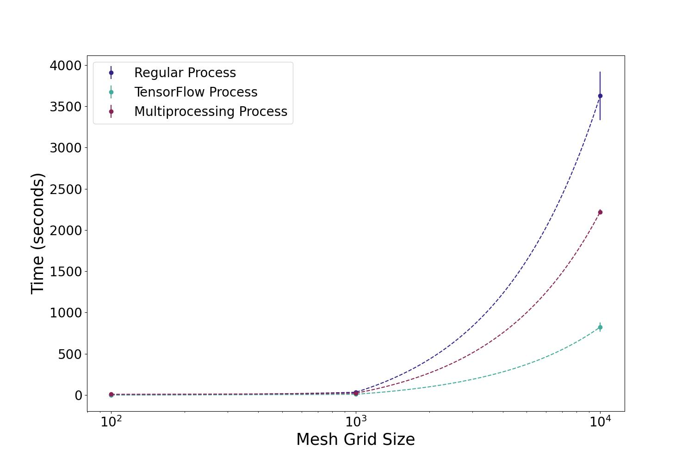
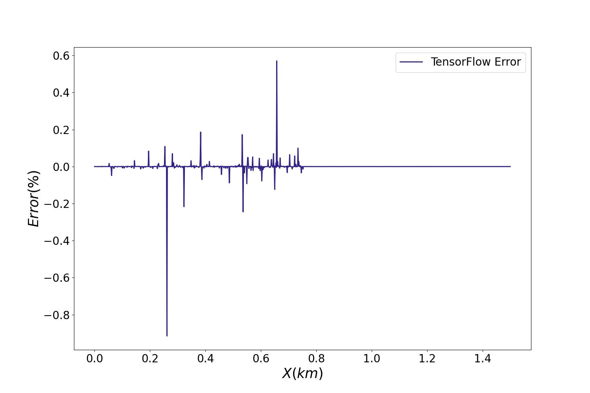

# Processing Time Experiment

This is an experiment to measure the processing speed, and calcuation erors, of Python with various configurations. These configurations are:

1) The basic processing with a single Central Processing Unit (CPU) core
2)  Multiple CPU cores using Python's multiprocessing native package
3)  Graphics Processing Unit (GPU) using TensorFlow 

## Results

The results for small batch calcuations showed no change. However, once given larger meshgrid set calcautions both TensorFlow & multiprocessing showed significant improvments.

### *Times for the processing speed experiment.*
| Mesh Grid Size | Regular (Sec) | TensorFlow (Sec) | Multiprocessing (Sec) |
|---------------|---------------|------------------|---------------------|
| 100 | 0.08314±0.00232 | 1.35401±0.14727 | 8.73846±0.26053 |
| 1,000 | 33.48606±1.56878 | 8.93515±0.54915 | 22.08205±1.02119 |
| 10,000 | 3627.16058±293.50415 | 823.66046±55.70785 | 2219.72157±31.04704 |

Interpolating these values shows an exponetial trend in calcaution time as larger calcautions took increasing time. TensorFlow had the most significant resutls in midigating this increase in processing time. 

### Error in Calcuation for Tensorflow (float 64 vs. 32)

The downside to TensorFlow is the floating point format. Utilizng `Numpy` in Python the calulations were cunducted in float 64, which desingations the precision in the decimal calcautions. TensorFlow utilizes float 32, which is less accurate and leads to the errors presetned below: 

## How-To Run

To run this program simply download both the `Processing_Time_Exp.py` along with the provided Asteroid_Database folder, and run in any Interactive Development Environment

*Note: The Meshgrid is initially set to the maximum of 10,000 & all the CPU cores will be used!! This can be modified below the '__main__' definition*

### Don't have tensorflow-gpu?
regular TensorFlow leverages the CPU for calculations, you MUST use tensrflow-gpu, and select a supported Graphics Processing Unit (GPU)
1) pip install both tensorflow and tensorflow-gpu
2) Download supporting CUDA & cuDNN software releases.
3) Run and collect data 

